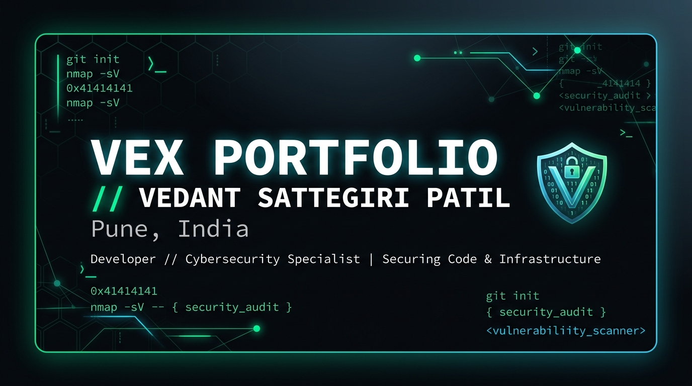

<div align="center">

# Vedant Sattegiri Patil

**A terminal-themed developer portfolio, with a CLI you can actually type into.**

[Live site](https://vedantbuilds.vercel.app) · [Projects](#projects) · [Run locally](#run-locally)




</div>

## About

Portfolio of **Vedant Sattegiri Patil (VEX)**, a student builder from Pune, India, working across cybersecurity, AI and software. The site is built like a terminal session: a boot sequence, a working command line, and a guestbook, wrapped in a clean, responsive layout.

## Features

- **Interactive CLI**: open it with `Ctrl/Cmd + K` or the backtick key and run commands to explore projects, skills and the resume
- **Dark and light themes** with an animated transition
- **Projects showcase** with a custom theme per project
- **Guestbook** powered by Firebase Auth and Firestore
- **Contact section** with a mailto form and optional Gmail API sending
- **Live GitHub stats** card
- **Resume** viewer and PDF download, generated with `pdf-lib`
- **Easter eggs**: boot screen, intro track, and a Konami code dev mode
- **Responsive and accessible**: keyboard navigation, reduced-motion support, mobile menu

## Projects

| Project | What it is |
| --- | --- |
| [AETHOS](https://github.com/vedwebsites-eng/AETHOSGAMMA) | Gamified self-improvement app: XP levels, habits, journaling and an AI coach |
| [Inkwell](https://github.com/vedwebsites-eng/INKWELL) | Distraction-free typographic note engine |
| [RootCause](https://youtube.com/@RootCauseTech) | Faceless tech and cybersecurity short-form video channel |

## Tech stack

| Area | Tools |
| --- | --- |
| Frontend | React 19, TypeScript, Tailwind CSS 4, Motion, Lucide |
| Build | Vite 8, esbuild, tsx |
| Server | Express (serves the app and the resume download) |
| Backend services | Firebase Auth, Firestore, Gmail API |
| Documents | pdf-lib |

## Project structure

```
src/
  components/   UI sections (Hero, About, Projects, Terminal, Guestbook, Contact...)
  context/      Theme provider
  data/         portfolioData.ts: all site content in one place
  services/     Firebase and Gmail helpers
  utils/        PDF generator
public/         Resume, images, icons, audio, sitemap
server.ts       Express server
firestore.rules Firestore security rules
```

All text content lives in `src/data/portfolioData.ts`. Edit that file to update the site without touching components.

## Run locally

Requirements: Node.js 20+ (or Bun).

```bash
git clone https://github.com/vedwebsites-eng/MyPortfolio.git
cd MyPortfolio
npm install
cp .env.example .env
npm run dev
```

Open http://localhost:3000.

| Script | What it does |
| --- | --- |
| `npm run dev` | Start dev server with hot reload |
| `npm run build` | Build client and server into `dist/` |
| `npm start` | Run the production build |
| `npm run lint` | Type-check with `tsc` |

## Environment variables

| Variable | Purpose |
| --- | --- |
| `GEMINI_API_KEY` | Server-side Gemini access (set in `.env`, never commit it) |
| `APP_URL` | Public URL of the deployed site |

Firebase web config lives in `firebase-applet-config.json`. These values are public identifiers. Access is controlled by `firestore.rules`.

## Contact

- Email: veddoesai@proton.me
- GitHub: [@vedwebsites-eng](https://github.com/vedwebsites-eng)
- YouTube: [RootCause](https://youtube.com/@RootCauseTech)

## License

Apache-2.0. Code is open for learning. Please don't copy the site 1:1 as your own portfolio. Credit and remix freely.
